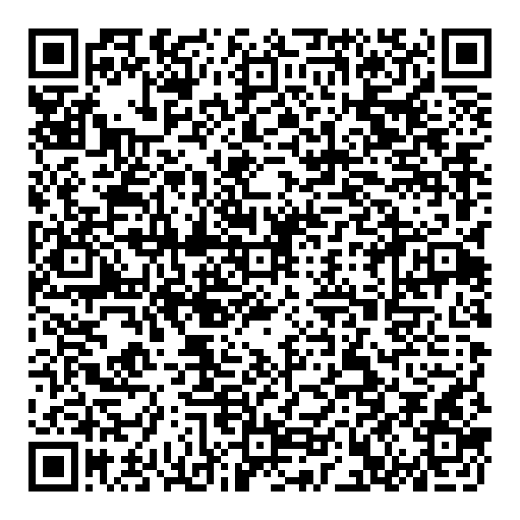

# Tarot Arcana Neón

Aplicación de Tarot de Sí o No para Rabbit R1. Incluye la baraja completa de los 22 Arcanos Mayores con arte pixel neón, síntesis de voz y consulta interactiva.

## Instalación en Rabbit R1

Escanea este código QR desde el menú **Creations > Add via QR code**:

URL directa: `https://evilrender23.github.io/tarot-arcana-neon/`

## Uso y Controles

- **Rueda**: Barajar mazo de cartas
- **Clic Botón Lateral**: Revelar tirada (Sí/No)
- **Mantener Botón Lateral**: Consultar interpretación al Oráculo
