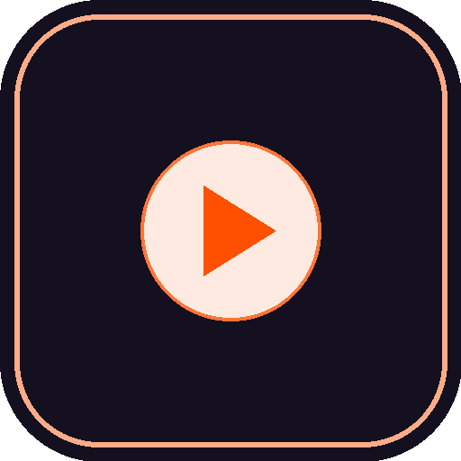

# 🃏 Tarot Arcana Neón - Rabbit R1 Creation

Una aplicación de Tarot de Sí o No con la baraja completa de los **22 Arcanos Mayores**, lectura en voz alta (Text-To-Speech), interfaz neón pixel-art de 16-bits de 240x282 px y consultas de IA persistentes para **Rabbit R1**.

---

## 📷 Código QR de Instalación Oficial (GitHub Pages 24/7)

Abre la aplicación **Creations** en tu dispositivo **Rabbit R1**, selecciona **`Add via QR code`** y escanea este código QR oficial:

* **URL Oficial Permanente**: `https://evilrender23.github.io/tarot-arcana-neon/`
* **Icono SVG**: `https://evilrender23.github.io/tarot-arcana-neon/icon.svg`

---

## 🕹️ Controles de Hardware en Rabbit R1

* **Rueda Giratoria (`scrollUp` / `scrollDown`)**: Baraja el mazo de 22 Arcanos Mayores con efectos de sonido sintetizados y animación de abanico 3D.
* **Botón Lateral (`sideClick`)**: Revela la tirada de Sí o No y lee la carta en voz alta por el altavoz.
* **Pulsación Larga del Botón Lateral (`longPressStart` / `longPressEnd`)**: Mantenlo presionado para formular tu pregunta en voz alta. La consulta quedará fijada en pantalla y el **Oráculo IA de Rabbit OS** te entregará su respuesta mística persistente.

---

## 🎨 Características Destacadas

* **22 Arcanos Mayores**: Ilustraciones y locuciones específicas desde el `0. EL LOCO` hasta el `XXI. EL MUNDO`.
* **Cero Pantalla en Negro**: Sistema de renderizado síncrono ultra-resiliente en `r1-bridge.js`.
* **Disponibilidad Permanente 24/7/365**: Hospedado en GitHub Pages con soporte HTTPS de alta velocidad.
